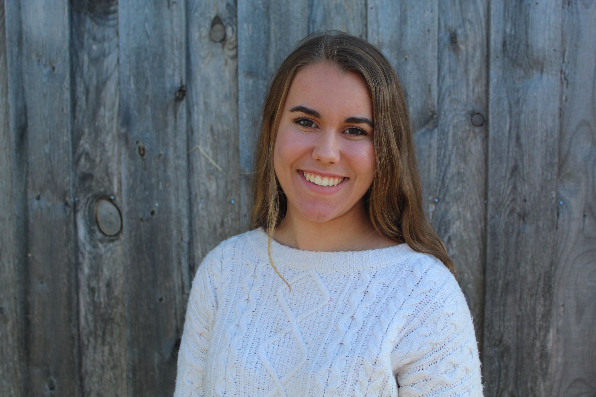

# Introduction

Hello! I'm Stephanie and I am from Warrenton, Virginia. My academic interests include business and entrepreneurship, but I took this COLL 100 class to explore data science. I am a total beginner with data science so I am hoping this class will push me to learn a lot! Outside of academics, I love baking, photography, and crocheting. I have started my own small business called SA Originals where I sell handmade crochet items which I plan to continue through college and beyond. 

# This is an index of my work
[Practice 1: A Path Of A Running Man](practice1.md)

[Practice 2: A More Complicated Graph](practice2.md)

[Practice 3: Path Of A Traveling Salesman](practice3.md)
