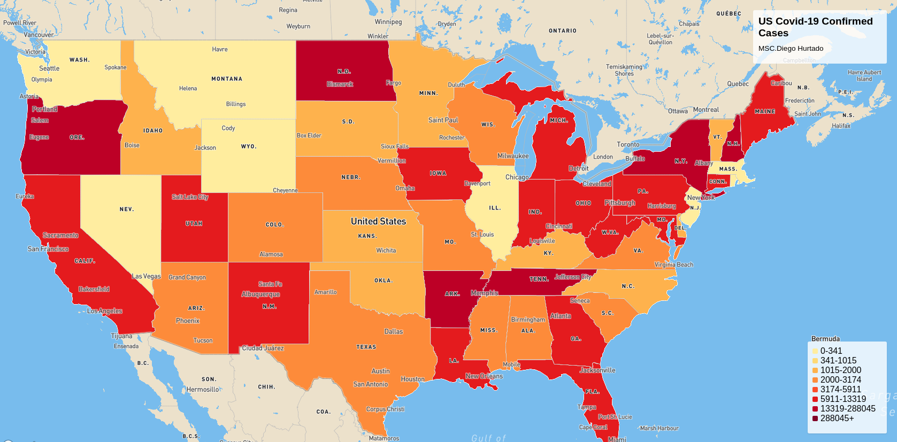
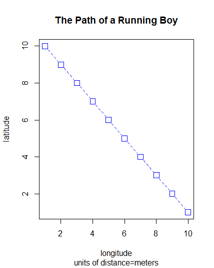

# This is an index of my work
[a link to exercise 1]()

# First Level Header

This is my first repository

## This Is A Test File Upload

# Path Of A Running Boy

## How To Produce A Line Plot
To make a line plot, assign values to the defined variables in the script using the assignment operator command (<-). Then tell R to plot those values on a line graph by writing plot (x,y, type = "o"). Add graph titles using the commands main=, sub=, xlab= ylab=. Change the line appearance with the commands lty= lwd= col= pch=. All of these commands can be added into the same parentheses after plot (x, y,......). Push run after adding everying to the script. The code put into the script will appear in the console and the graph will appear.
