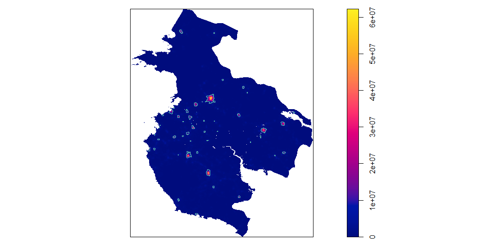
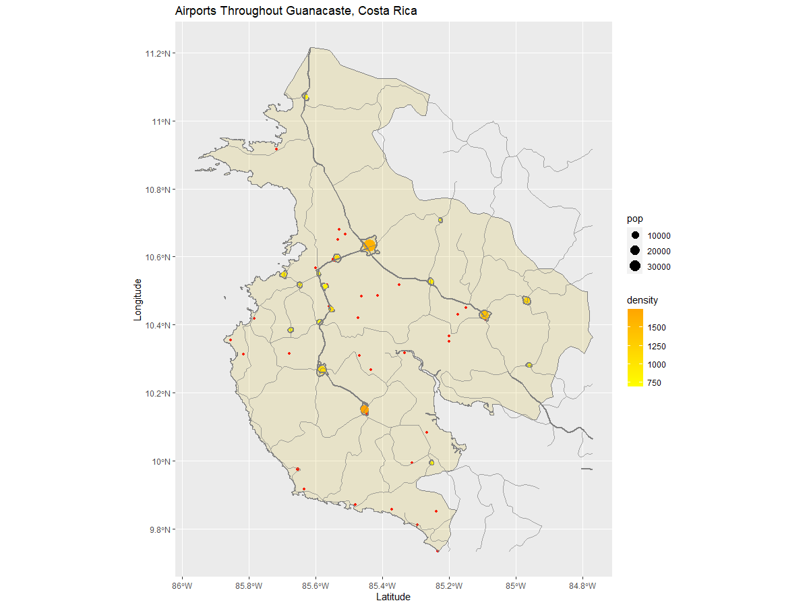
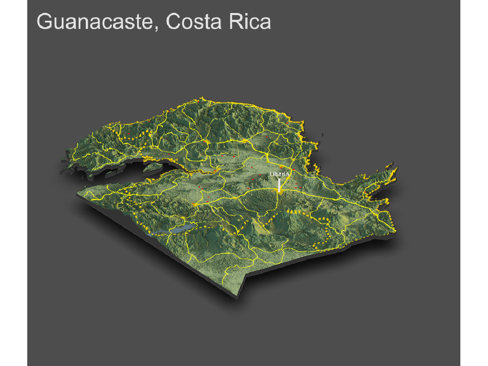

# Assessibility 1

## De facto description of human settlements and urban areas

For the final project, I investigated the population density and urbanization withing Guanacaste, one of Costa Rica's ADM 1 subdivisions.

The following plot shows the estimated populaiton within Guanacaste as a raster image. The areas that are most populated appear in green while the least populated remain white. The areas with color are in small pinpointed areas, reflecting the idea that Guanacaste is very sparcely populated, with small cities sprinkled throughout.

This image is a probability model based on the population data. It displays where 392,000 people live geospacially thorughout Guanacaste's 2,541,487 gridcells.

This plot shows the population density of guanacaste, as well as the unfiltered polygons of the urbanized areas.

This plot reflects the urban area polygons and thier density. 

The following shows a plot of the defacto urban areas and human settlements. Each urban area is described in terms of its population and density, two ways to describe the urbanization within an area. Areas with a greater population have a larger dot compared to urban areas with a smaller population. Areas that have a higher density appear a darker red color while those urbanized areas with a smaller density are yellow.  

# Assessibility 2

## Adding transportation facilities & health care services

This plot shows the urbanized areas throughout Guanacaste as well as the road network and airport locations throughout. Like before, the populaiton and density of the urbanized area are represented by the size and color of the dot. This time, the scale of density ranges in color from yellow to orange becasue I used small red dots to represent the locations of airports, a sign of development. 

There are several airports that appear along the coastline. This reflects the idea that many planes would be coming from the pacific ocean, making this an ideal location. These airports are far away from the main urbanized areas as well as the main road network, so they are probably not utilized by local civilians. Instead, locals would use one of the many airports located closer. In general, locations of airports tend to be on the outskirts of cities, where planes can get to them more eaily.

The primary road system is darker than the secondary. The primary road runs from the north west to the south east of the region. The primary road network runs through 11 of the major urbanized areas. These roads are most likely utilized most, because going to and from major cities is going to be a common transportation route. The transportation network is extensive in the unurbanized areas as well, especially considering that these areas are not heavily trafficed. It is surprising that there are not more roads directly next to certain airports on the inland, but then again, that may be why these airports are here becasue it is harder to get to by way of car, and having a smaller airport is beneficial. There may also be other "roads" that are here and are underdeveloped so they do not appear in road network data. 

Guanacaste has 392,000 persons living within 18 distinctly defined human settlements or urban areas. The 18 areas have the following combination of population density: 39636 persons with a density of 1600, 11849 persons with a density of 1130, 12434 persons with a density of 1430, 14015 persons with a density of 1741, 6375 persons with a density of 1208, 5312 persons with a density 0f 1117, 38434 persons with a density of 10005, 30003 persons with a density of 872, 3139 persons with a densiyt of 946, 2547 persons with  a density of 848, 1903 persons with a density of 696, 2813 persons with a density of 1149, 2148 persons with a density of 904, 1760 persons with a density of 771, 1658 persons with a density of 770, 1519 persons with a density of 782, 1410 persons with a density of 853, and finally 1112 persons with a density of 745. This accounts for about 75,000 persons. The rest of the population is not dense enough to be considered urbanized. 

# Assessibility 3

## Rendering Topography

The topography has appeared to impact development of urban areas in that there are lots of mountain ranges and volcanoes that cover the area. This topography is not good for development, so naturally, the areas of development are in the valleys. 

How has topography appeared to have impacted the development of urban areas?
How has topography appeared to have impacted the development of transportation facilities?
How has topography appeared to have impacted the location of health care facilities?
Has producing your three-dimensional map resulted in an interpretion that is different from your previous analysis?
