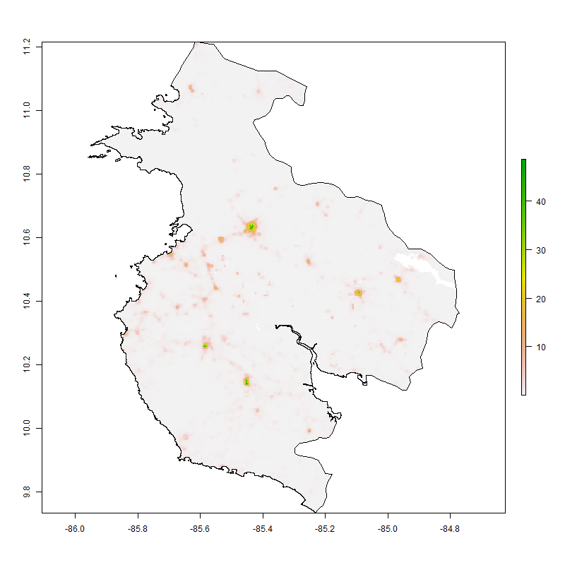
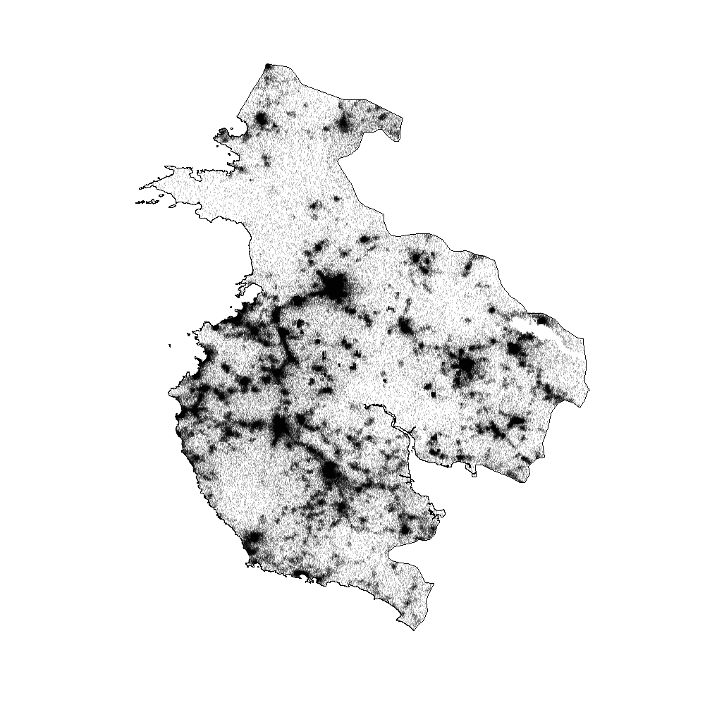
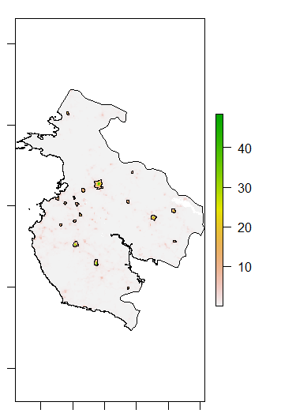
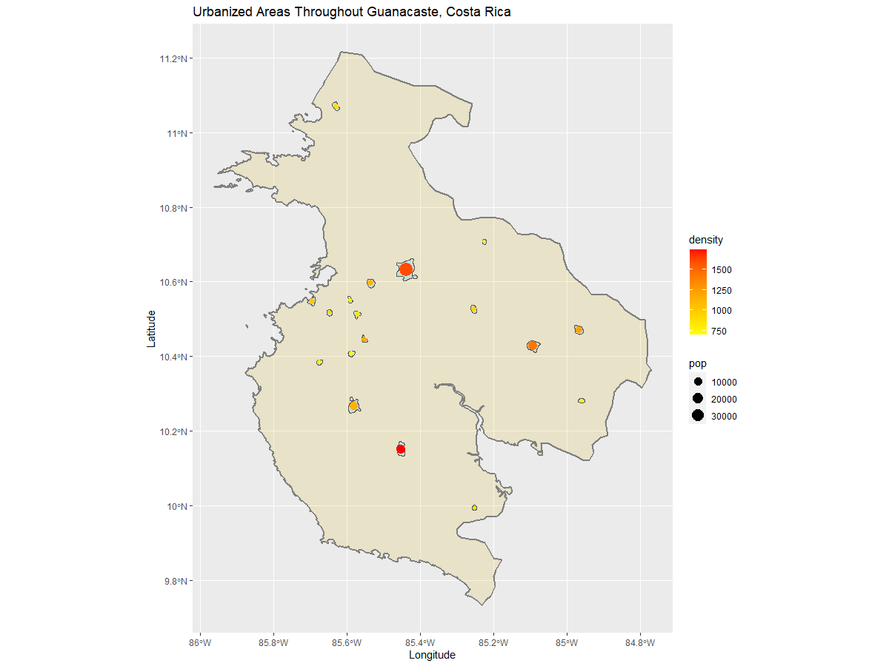

# Assessibility 1

## De facto description of human settlements and urban areas

For the final project, I investigated the population density and urbanization withing Guanacaste, one of Costa Rica's ADM 1 subdivisions.

The following plot shows the estimated populaiton within Guanacaste as a raster image. The areas that are most populated appear in green while the least populated remain white. The areas with color are in small pinpointed areas, reflecting the idea that Guanacaste is very sparcely populated, with small cities sprinkled throughout.

This image is a probability model based on the population data. It displays where 392,000 people live geospacially thorughout Guanacaste's 2,541,487 gridcells.

This plot reflects the urban area polygons and thier density. 

The following shows a plot of the defacto urban areas and human settlements. Each urban area is described in terms of its population and density, two ways to describe the urbanization within an area. Areas with a greater population have a larger dot compared to urban areas with a smaller population. Areas that have a higher density appear a darker red color while those urbanized areas with a smaller density are yellow.  

# Assessibility 2

## Adding transportation facilities & health care services

