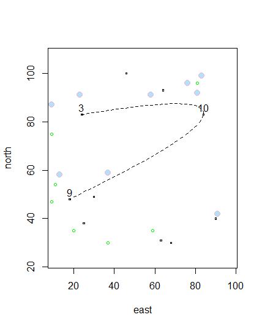

# More Complicated Plot

## How This Plot Was Created
This time, instead of giving the graph coordinate points, I used code to randomly assign ten points with the sampele() command. Circles were added using the symbol() command. Dwellings were created using data frames. Lines were created to connect 3 randomly selected dwellings by using the locs() command to do the random selection and then putting this command into the lines() command which connected them. To make the line curved instead of straight, use the xspline() command. 
