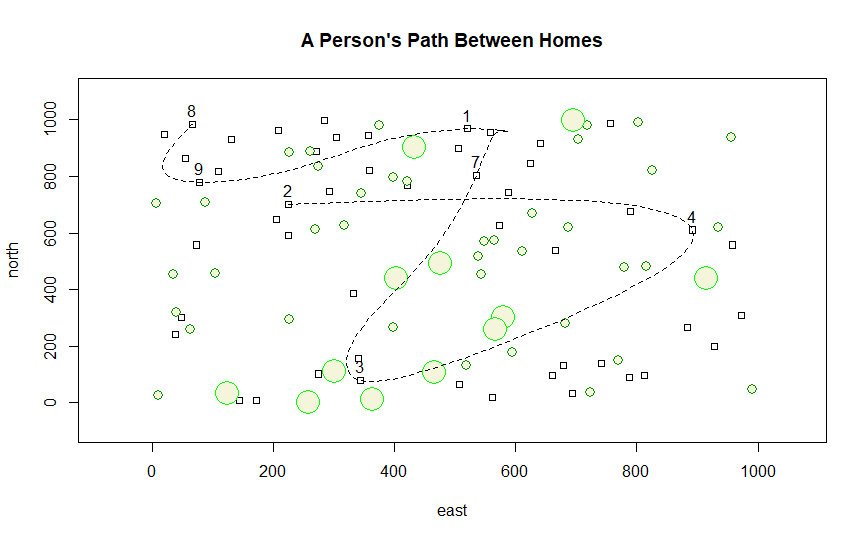

# A Person's Path Between Homes

## How to Create
This challenge question manipulated the previous graph made. It still used a similar outline and commands, but the number dwellings, trees, homes selected and possible x and y values were larger.

