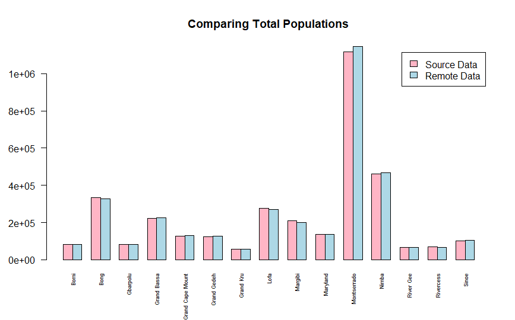
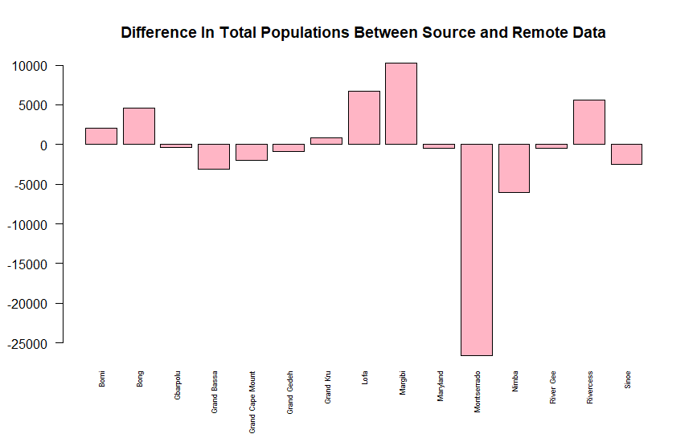
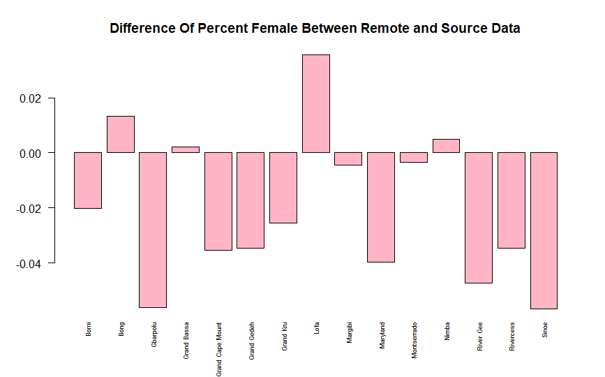
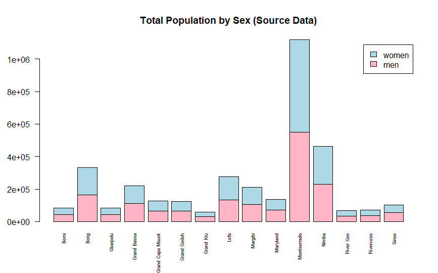
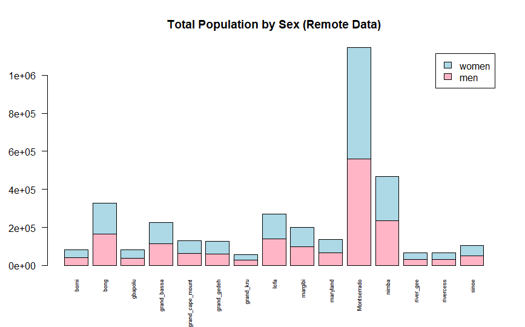
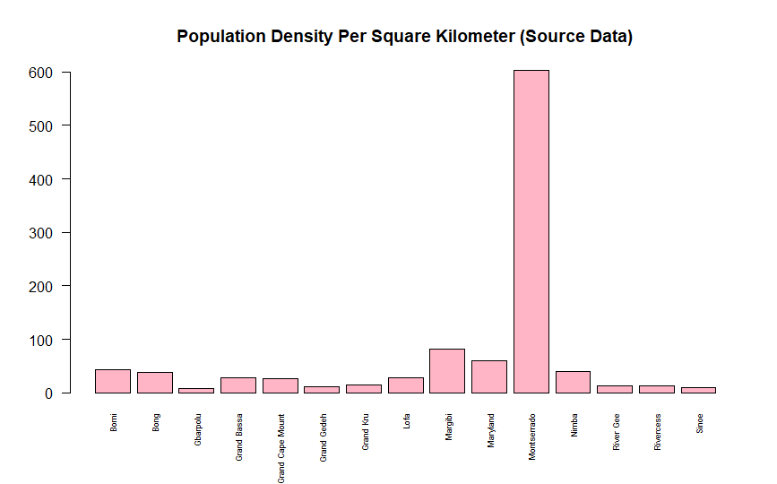

# Data Management Basics

In this exercise, I imported two data sets on the county populations in Liberia. One data set was reported locally from sources in Liberia and the other data set was reported from the United states, a remote source outside of Liberia. The data sets were manipulated to be the same format so they could be compared. The bar plots below show where discrepancies between the source and remote data occur, and when they are good representations of each other. 

A positive value represents a greater population reported in the source data, while a negative value represents a greater population reported in the remote data. 

A positive value represents a greater percent of female reported in the source data, while a negative value represents a greater percent of female reported in the remote data.

