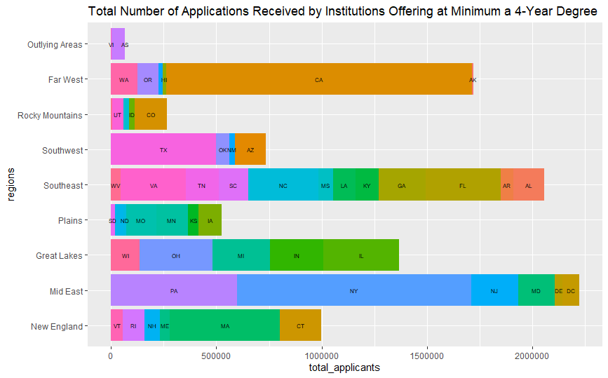
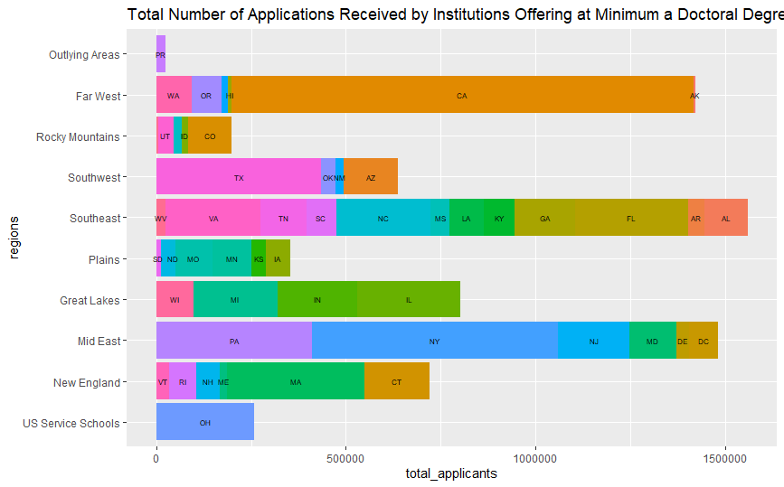
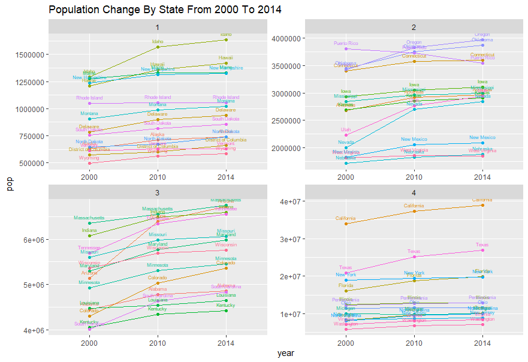

# Project 1 : Data Management Basics

# Part 1

## Data is from the National Center For Educational Statistics for the year 2015.

The following two plots graphically represent the total number of applications received by institutions across the United States, within distinct graphical regions. The regional bars are color coded by state, so one can see the proportional distribution within each region as to which state(s) the applications came from. By comparing the two plots, one can compare the total number of applications within each region, or more specifically within each state, received by institutions offering a minimum of a 4 year degree versus a mimimum of a doctoral degree.

# Part 2 

## Data is from the United States Census Bureau for the years 2000, 2010, 2014

The following plot provides a graphical representation of population data from the United States Census Bureau. All 50 states as well as the District of Columbia and Puerto Rico are represented over the census from 2000 to 2014. Quantiles were used to split the data into 4 sections based on population size. As a result the population values were able to spread out along the y-axis, making the graph more legible. For most areas, the population grew every year when the census data was collected, however there were a few exceptions. New York and New Hampshire did not have a large populaiton gain over the 14 year span. New York only grew by about 770,00 people while New Hampshire only grew by 91,027 people. While this may seem like a lot of people, the line representing these states on the graph is very flat or horizontal showing that in proportion to the overall population of the state, it did not grow by a lot. Puerto Rico decreased in populaiton size over the 14 year span by about 260,000 people. 

