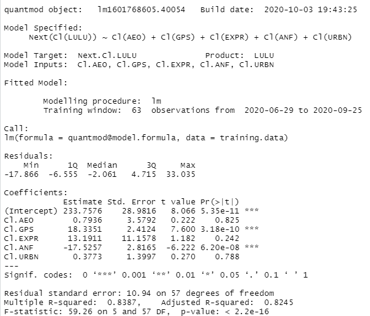
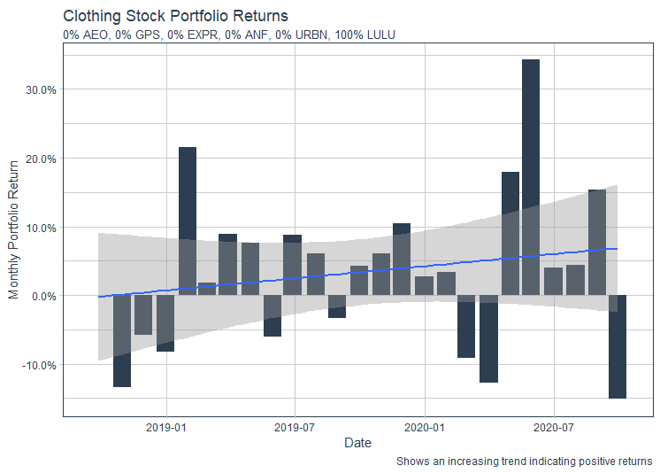
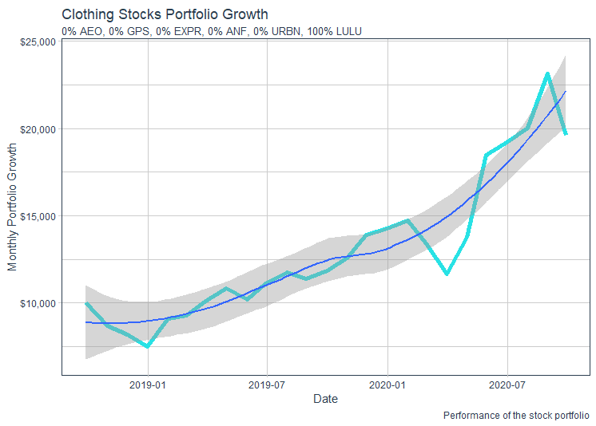

# Project 2: Data Management Fundamentals

# Part 1: Independently Accessing an API and Creating your Own Plots
## Data is from the American Community Survey 5-Year Data from the years 2010 to 2014

### The following graphs show state populaitons as well as Washington DC and Puerto Rico collected from survey data from 2010 to 2014. 

This plot shows the actual state population for each year based on the survey data. The states and regions are broken down into 9 quantiles based on the size of the population change that occured. Therefore, states and regions in the first group experienced the lowest populaiton change. In the case of Puerto Rico, Michigan, and Rhode Island, they had a negative populaiton change meaning their population shrunk overall from 2010 to 2014. States and regions in the nineth group experienced the largest populaiton change. Texas, California, and Florida were the states with the largest population change.

This plot shows the average population change, so each state or region has a constant slope over the 4 year span. Again, 9 quantiles were used, but this time it was based on the average population change. Therefore, the first grouping had the smallest or negative average change while the nineth group experienced the largest average change. 

### Stretch Goal
This plot is based on data on the number of housing units in each state over the 4 year period. The first plot is the actual housing unit change while the second is the average housing unit change. Again 9 quantiles were used based on the unit change and average unit change proportionately. One can compare the previous two plots to see how populaiton changed in regards to the sheer number of people versus the number of household units. This will give a better picture of whether changes were due to families moving or births and deaths. 

# Part 2: Using the Stock Market to Describe, Analyze and Predict

The following matrix represents the relationship between 6 clothing brank stocks: Lululemon, American Eagle, Gap, Express, Abrecrombie and Fitch, and Urban Outfitters. I used Lululemon as the response variable and the other 5 stocks as the predictor stocks. This means that the model predicts what will happen to Lululemon stock based on statistical data from the training period of 06/28/2020 - 09/27/2020 as to whether the other 5 stocks increased or decreased in value. 

The following plot shows a the relationship of one stock to the value of all the other stock values over the training period, each in separate grids. In general, there is a negative coorelation between Lululemon stock price and the other 5 predictor stocks. This is seen in the first "column" of the matrix. Therefore, if Lululemon stock increases, then the predictor stocks decreased. Another generalization that can be helpful in analyzing the stock data is that the 5 predictor stocks have a positive coorelaiton between them, meaning that if one predictor stock increased, the other increased as well and vice versa if the stocks decrease. 

The following summary of the model shows statistical data about the strenght of the model that was created. The r-squared value is about .84 which can be interpreted as the model being able to accurately predict about 84% of the time. Because this value is high, the inputs of the selected stocks are effective predictors to estimate Lululemon's stock. 

#### Summary

# Part 3: Using tidyquant Analyze Stock Performance

The following candlestick plot shows the returns expressed as a percentage from investing $10,000 across the same 6 stocks selected in part 2 and allocating the money to try to maximize profit. The allocation I used was to invest all $10,000 into Lululemon because this stock performed the best during the time period used of 09/28/2018 to 09/29/2020. The other 5 stocks decreased in overall value from the beginning of the period to the end. This reflects the conclusion found in part 2 when predicting Lululemon stock value based on the 5 predictor stocks that if the 5 stocks decrease in value, Lululemon tends to increase in value. Someone could have chosen to invest their money in multiple stocks, but becaue those stocks did not do as well, their percent of returns would not have been as high as someone who only invested in Lululemon. The positive sloping line shows that returns from investing in Lululemon are increasing over time.

This plot shows the change in value of the portfolio in terms of the dollar amount across the time period. During the time period, the portfolio doubled increasing from $10,000 to just under $20,000.

