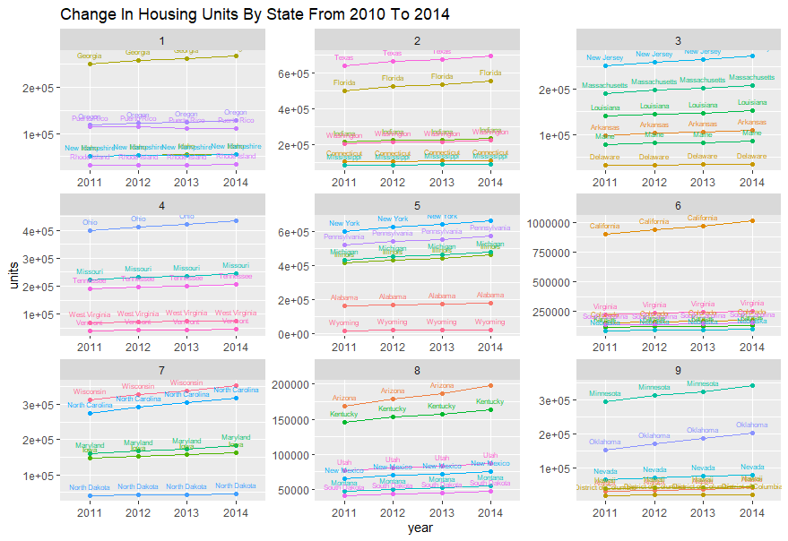

# Project 2: Data Management Fundamentals

# Part 1: Independently Accessing an API and Creating your Own Plots
## Data is from the American Community Survey 5-Year Data from the years 2010 to 2014

### The following graphs show state populaitons as well as Washington DC and Puerto Rico collected from survey data from 2010 to 2014. 

This plot shows the actual state population for each year based on the survey data. The states and regions are broken down into 9 quantiles based on the size of the population change that occured. Therefore, states and regions in the first group experienced the lowest populaiton change. In the case of Puerto Rico, Michigan, and Rhode Island, they had a negative populaiton change meaning their population shrunk overall from 2010 to 2014. States and regions in the nineth group experienced the largest populaiton change. Texas, California, and Florida were the states with the largest population change.

This plot shows the average population change, so each state or region has a constant slope over the 4 year span. Again, 9 quantiles were used, but this time it was based on the average population change. Therefore, the first grouping had the smallest or negative average change while the nineth group experienced the largest average change. 

### Stretch Goal
This plot is based on data on the number of housing units in each state over the 4 year period. The first plot is the actual housing unit change while the second is the average housing unit change. Again 9 quantiles were used based on the unit change and average unit change proportionately. One can compare the previous two plots to see how populaiton changed in regards to the sheer number of people versus the number of household units. This will give a better picture of whether changes were due to families moving or births and deaths. 

# Part 2: Using the Stock Market to Describe, Analyze and Predict

<a href="Stephanie-Schefer.github.io/master/summary_lulu_prediction_model.pdf" target="_blank">PDF.</a>

