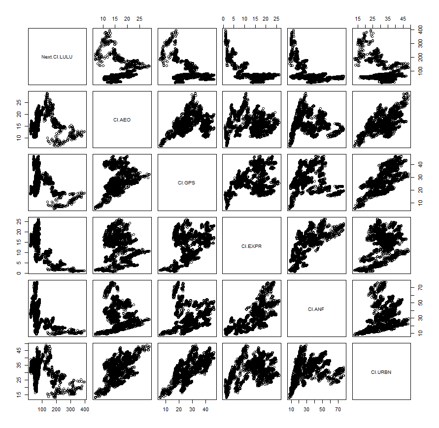

# Project 2: Data Management Fundamentals

# Part 1: Independently Accessing an API and Creating your Own Plots
## Data is from the American Community Survey 5-Year Data from the years 2010 to 2014

### The following graphs show state populaitons as well as Washington DC and Puerto Rico collected from survey data from 2010 to 2014. 

This plot shows the actual state population for each year based on the survey data. The states and regions are broken down into 9 quantiles based on the size of the population change that occured. Therefore, states and regions in the first group experienced the lowest populaiton change. In the case of Puerto Rico, Michigan, and Rhode Island, they had a negative populaiton change meaning their population shrunk overall from 2010 to 2014. States and regions in the nineth group experienced the largest populaiton change. Texas, California, and Florida were the states with the largest population change.

This plot shows the average population change, so each state or region has a constant slope over the 4 year span. Again, 9 quantiles were used, but this time it was based on the average population change. Therefore, the first grouping had the smallest or negative average change while the nineth group experienced the largest average change. 

### Stretch Goal
This plot is based on data on the number of housing units in each state over the 4 year period. The first plot is the actual housing unit change while the second is the average housing unit change. Again 9 quantiles were used based on the unit change and average unit change proportionately. One can compare the previous two plots to see how populaiton changed in regards to the sheer number of people versus the number of household units. This will give a better picture of whether changes were due to families moving or births and deaths. 

# Part 2: Using the Stock Market to Describe, Analyze and Predict

The following matrix represents the relationship between 6 clothing brank stocks: Lululemon, American Eagle, Gap, Express, Abrecrombie and Fitch, and Urban Outfitters. I used Lululemon as the response variable and the other 5 stocks as the predictor stocks. This means that the model predicts what will happen to Lululemon stock based on statistical data from the training period of 06/28/2020 - 09/27/2020 as to whether the other 5 stocks increased or decreased in value. 

The following summary of the model shows statistical data about the strenght of the model that was created. The r-squared value is about .84 which can be interpreted as the model being able to accurately predict about 84% of the time. Because this value is high, the inputs of the selected stocks are effective predictors to estimate Lululemon's stock. 
###### Summary

quantmod object:   lm1601768605.40054 	Build date:  2020-10-03 19:43:25 

Model Specified: 
     Next(Cl(LULU)) ~ Cl(AEO) + Cl(GPS) + Cl(EXPR) + Cl(ANF) + Cl(URBN) 

Model Target:  Next.Cl.LULU 		 Product:  LULU 
Model Inputs:  Cl.AEO, Cl.GPS, Cl.EXPR, Cl.ANF, Cl.URBN 

Fitted Model: 

	Modelling procedure:  lm 
	Training window:  63  observations from  2020-06-29 to 2020-09-25

Call:
lm(formula = quantmod@model.formula, data = training.data)

Residuals:
    Min      1Q  Median      3Q     Max 
-17.866  -6.555  -2.061   4.715  33.035 

Coefficients:
            Estimate Std. Error t value Pr(>|t|)    
(Intercept) 233.7576    28.9816   8.066 5.35e-11 ***
Cl.AEO        0.7936     3.5792   0.222    0.825    
Cl.GPS       18.3351     2.4124   7.600 3.18e-10 ***
Cl.EXPR      13.1911    11.1578   1.182    0.242    
Cl.ANF      -17.5257     2.8165  -6.222 6.20e-08 ***
Cl.URBN       0.3773     1.3997   0.270    0.788    
---
Signif. codes:  0 ‘***’ 0.001 ‘**’ 0.01 ‘*’ 0.05 ‘.’ 0.1 ‘ ’ 1

Residual standard error: 10.94 on 57 degrees of freedom
Multiple R-squared:  0.8387,	Adjusted R-squared:  0.8245 
F-statistic: 59.26 on 5 and 57 DF,  p-value: < 2.2e-16

