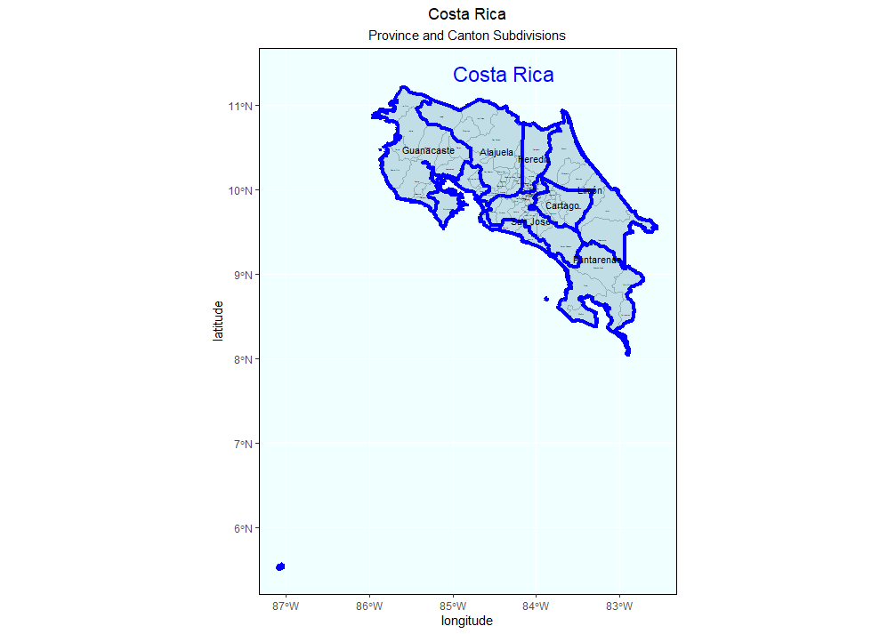
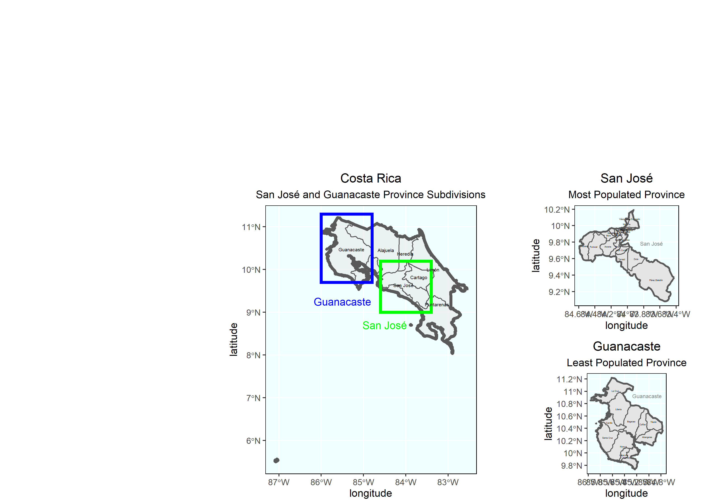

# Projecting, Plotting, and Labelling Administrative Subdivisions

## Part 1

The plot below was created by downloading shape files from GADM and using the simple feature package on rstudio. This map shows the outline of Costa Rica as well as the province and canton subdivisions. Costa Rica has 7 provinces and 82 cantons in total. These cantons can be subdivided again into areas called districts. 

## Part 2 : Stretch Goals 1 and 2

The following plot shows Costa Rica and it's subdivisions. The country is made up of 7 provinces. The most populated province is San Jose which is the capital city and has about 1.6 million people. The least populated province is Guanacaste which only has about 354 thousand people. Both provinces are identified below and further broken down into their cantons. San Jose has 20 cantons and Guanacaste only has 11 cantons. 

