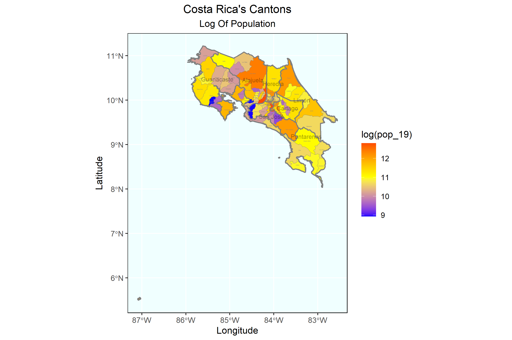
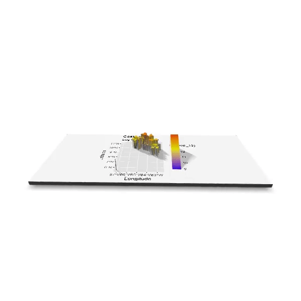
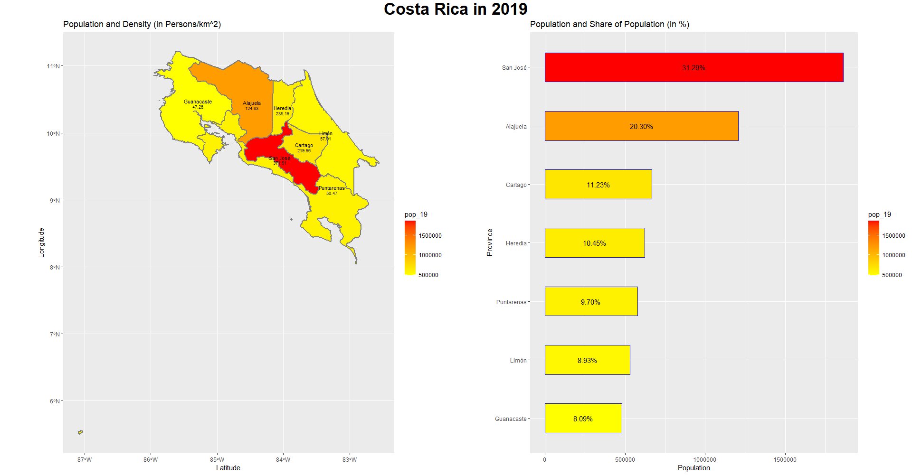
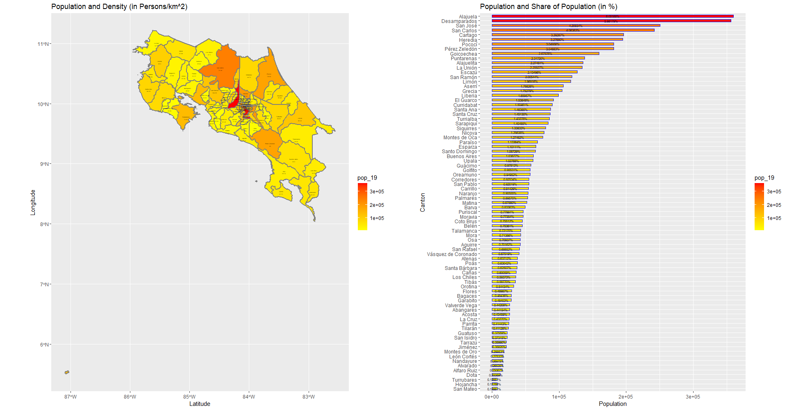

# Projecting, Plotting and Labelling Administrative Subdivisions Continued

## Challenge Question
The following plot shows the adm1 subdivisions of Costa Rica and how the population is distributed between these 7 Provinces. The most populated Provinces appear red while the least populated are yellow. The plot shows that San Jose has the highest population, followed by Alajuela, and then all other Provinces have about the same population count. 

## Individual Stretch Goal 1

This plot resembles the challege question by showing the populaiton distribution among geographic boundaries, but this time, the adm2 sf data was used to show the population distribuiton by Canton. This allows individuals to see a more precise picture of what areas are most and least populated. The most populated Canton is the capital city of San Jose with 360,141 persons and the least populated Canton is Turrubares with only 7,535 persons. 

## Individual Stretch Goal 2

This plot combines the outline boarders from adm1 and adm2. The population count data still fills the cantons to show the distribution of the populaiton among the country, but now the log of the population count was used to simplify the scale numbers. The population distribution is now represented by three colors: blue is the least populated, yellow is the mildly populated and red is heavily populated. Having more colors makes it easier to compare the population of different cantons because there is more distinction between different population counts versus them all being the same color. 

## Individual Stretch Goal 3

This rotating plot once again used the log of population count to show the distribuiton of the population among the cantons. Once again, the cantons are color coded by population size. In addition, the cantons with the highest population counts appear to be taller and the less populated cantons appear shorter. 

# Creating a Geometric Bar Plot with your Simple Feature Object

This figure presents a spacial map of Costa Rica Provinces, annotated with the name and population density of each province in persons per square kilometer. The bar plot shows the population within each province as well as the percentage of the populaiton the count is. 

## Stretch Goal 1

The following geometric bar plot shows the population total for each province of Costa Rica as well as the breakdown of the population 

