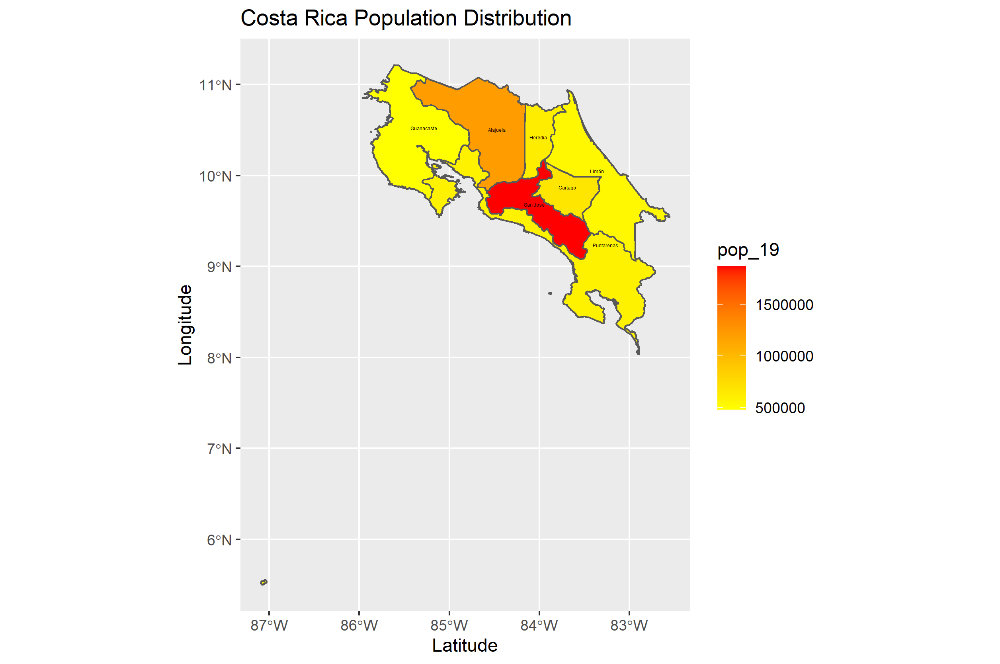
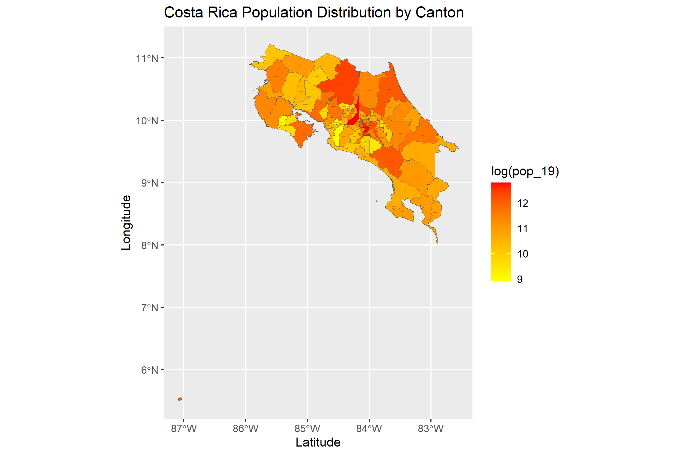

# Projecting, Plotting and Labelling Administrative Subdivisions Continued

## Challenge Question
The following plot shows the adm1 subdivisions of Costa Rica and how the population is distributed between these 7 Provinces. The most populated Provinces appear red while the least populated are yellow. The plot shows that San Jose has the highest population, followed by Alajuela, and then all other Provinces have about the same population count. 

## Individual Stretch Goal 1

This plot resembles the challege question by showing the populaiton distribution among geographic boundaries, but this time, the adm2 sf data was used to show the population distribuiton by Canton. This allows individuals to see a more precise picture of what areas are most and least populated. The most populated Canton is the capital city of San Jose with 360,141 persons and the least populated Canton is Turrubares with only 7,535 persons. 

