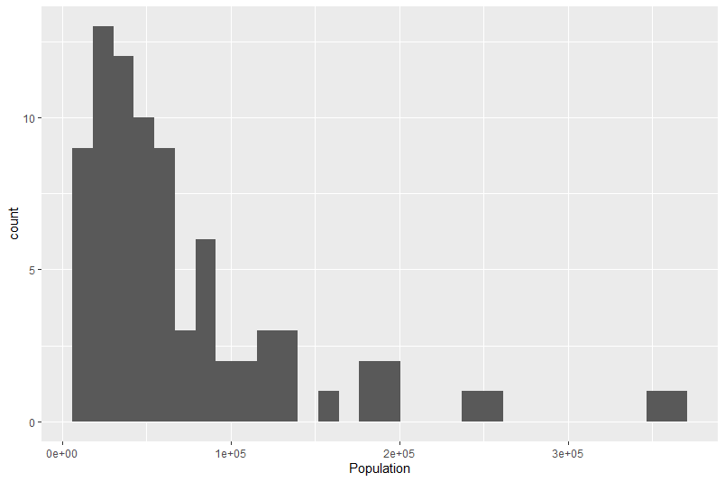
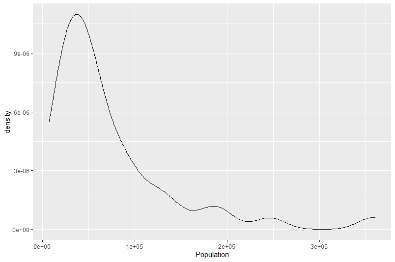
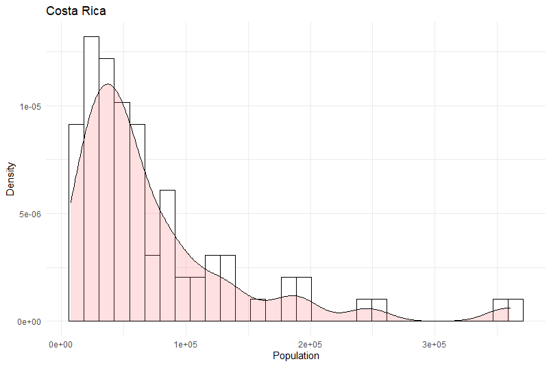

# Acquiring, Modifying and Describing the Data

## Rasterstack Plots

This plot shows layer 12, which represents the slope or steepness of land across Costa Rica. The greatest slope in the country is about 50, while the majority of the country is flat. There are several volcanoes in Costa Rica which are located in areas around where this plot shows the slop of 50.  

This plot shows layer 8 which represents dts_160 : tree cover, flooded, fresh or brakish water. Across the country, values range from 0 to 100.

This plot shows layer 10 which represents bare areas. The most baren areas occurs around the perimeter of the country.  

The following plot represents bins of population or certain ranges of populaiton on the x axis with the count, or number of times that a Canton had the range of population. The max population within the country occurs very few times, while smaller ranges of population occur frequently.

This plot represents population and density. The density is actually higher in Cantons of smaller population, meaning that even though there are fewer people in these areas, they tend to have a higher number of people per area. The Cantons with lower population counts, must have smaller land area, causing the density to be higher. 

