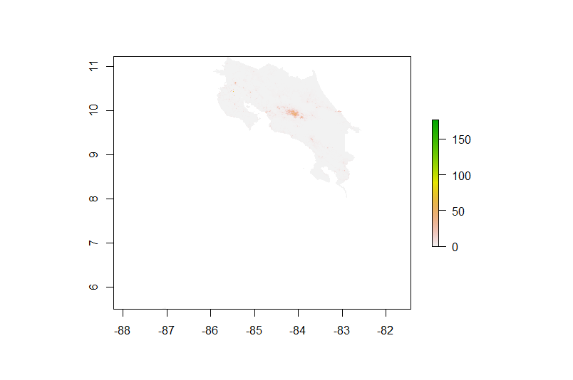

# Acquiring, Modifying and Describing the Data

## Rasterstack Plots

This plot shows layer 12, which represents the slope or steepness of land across Costa Rica. The greatest slope in the country is about 50, while the majority of the country is flat. There are several volcanoes in Costa Rica which are located in areas around where this plot shows the slop of 50.  

This plot shows layer 8 which represents dts_160 : tree cover, flooded, fresh or brakish water. Across the country, values range from 0 to 100.

This plot shows layer 10 which represents bare areas. The most baren areas occurs around the perimeter of the country.  

